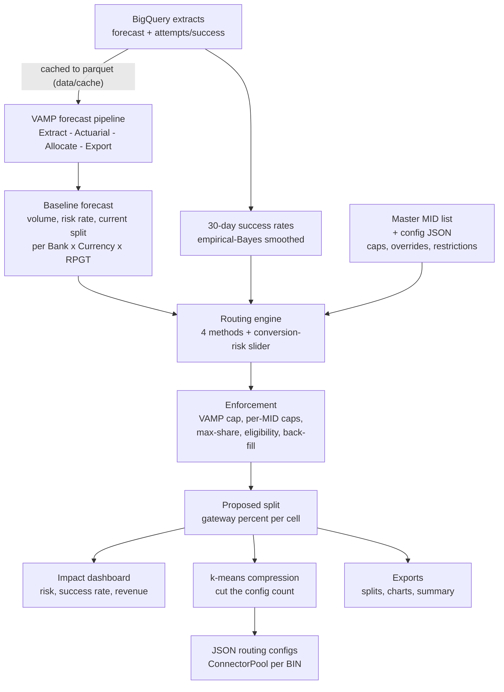
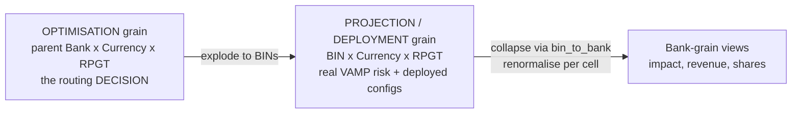
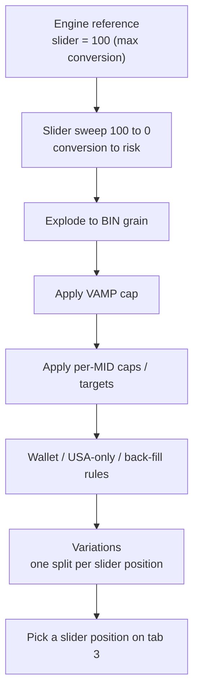
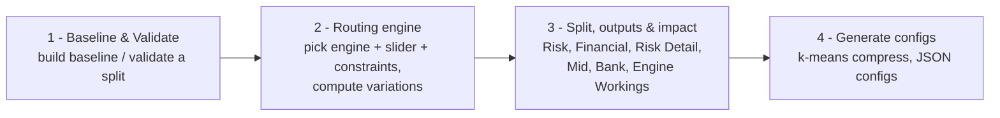
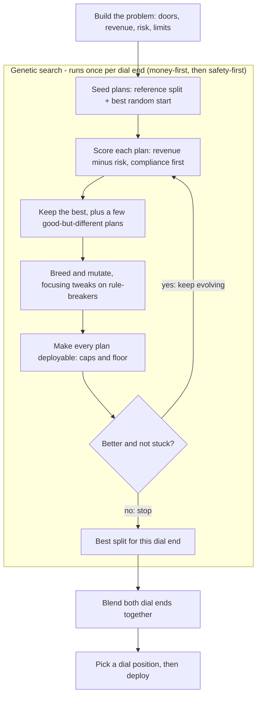
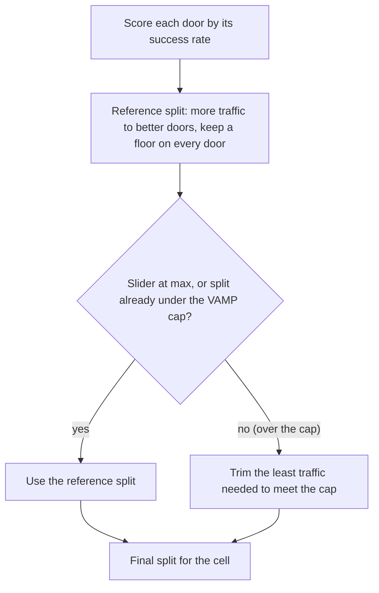
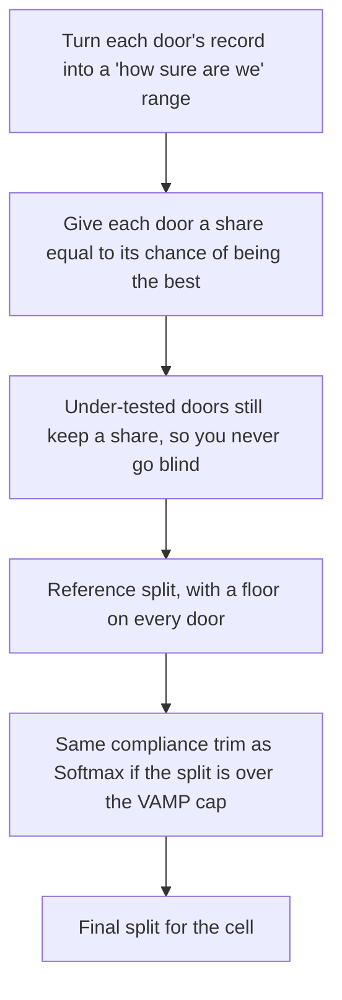
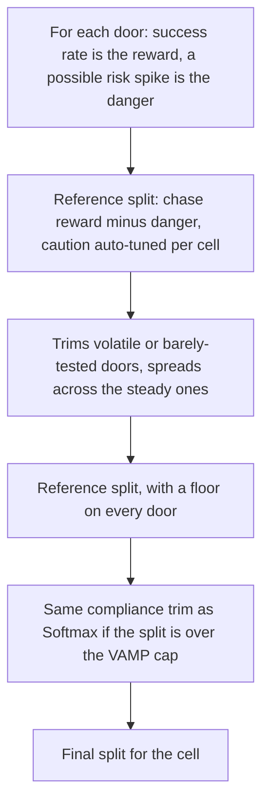

# Transaction Routing Optimiser

Batch tool that decides **what fraction of each transaction cell to send to each
gateway/MID**, to maximise the success (authorisation) rate while staying inside
your risk / chargeback (Visa VAMP) limits. It plugs into your existing VAMP
forecast pipeline: it consumes the "pre" (baseline) forecast and produces a
proposed split, an impact dashboard, compressed rules, and ready-to-ship JSON
routing configs.

A **cell** = one `RPGT (transaction type) x Currency x Bank` combination.

## Glossary

New to the project? These are the words used everywhere, in plain terms.

- **Cell** — one Bank × Currency × transaction-type combination. The routing decision is made per cell.
- **Gateway / MID** — a payment route (a "door") a payment can be sent through. A MID is a merchant account at a gateway.
- **Split** — the decision: what percentage of a cell's payments goes to each gateway. The percentages add up to 100%.
- **RPGT** — the transaction type (e.g. new sale, renewal, upgrade). Part of what defines a cell.
- **Success rate** (authorisation rate) — the share of attempted payments that get approved. Higher is better.
- **Risk rate / VAMP rate** — the share of payments that become chargebacks/fraud flags. Lower is better.
- **VAMP** — Visa's fraud-monitoring programme. Go over its limit and you get penalised.
- **VAMP cap** — the maximum risk rate allowed. A split must keep `share × risk` under it.
- **Reference split** — the starting split each engine builds for maximum conversion (slider at 100), before any risk trimming.
- **Slider (conversion ↔ risk)** — a dial from 100 (chase the most approved payments) to 0 (play it safest / most compliant).
- **Exploration floor** — a minimum share every eligible gateway keeps, so no door goes completely dark.
- **Max share** — the most any single gateway is allowed to take of a cell.
- **Engine** — the method that decides the split (Softmax, Thompson, Portfolio, Genetic). All read the same input and give the same kind of output.
- **Baseline / pre-forecast** — the current expected state before optimising; what a proposal is compared against.
- **BIN** — the first digits of a card number that identify the issuing bank; the fine grain used for real risk and deployed configs.
- **Pool / config** — a deployable routing rule (JSON). "Pools" is how many distinct rules ship.
- **Compression (k-means)** — grouping similar cells so fewer distinct splits/pools need deploying.
- **Constraint** — a rule the split must respect. **Hard** = must hold (caps, max share); **soft** = penalised but allowed (floor, stability).

## Inputs & settings — what each control does, and what the values mean

A quick reference for every input, grouped by the panel it lives in. Format: **control** — what it does. *Values:* what the options / range mean (default in brackets).

### 1. Company & forecast

- **Company** — which brand's data to load and route. *Values:* one of your configured companies (e.g. TotalAV).
- **Card Scheme** — which card network to optimise; also sets the risk programme and BIN prefix. *Values:* visa or mastercard.
- **M0 … Total** — the baseline forecast volume (transactions) for the current month; the volume the split is applied to. *Values:* a transaction count.

### 2. Engine type & settings

- **Split engine** — the method that decides the split. *Values:* Softmax (steady, temperature-controlled), Thompson (explores thinly-tested gateways), Portfolio (shies away from gateways whose risk could spike), Genetic (the CMA-ES search — best at meeting the hard risk limits while keeping revenue).
- **Optimisation objective** (Genetic) — what "best" means. *Values:* Revenue (volume × success rate × avg ticket) or Volume-weighted success rate (most approved transactions, ignoring ticket value). Both still meet every risk limit.
- **Temperature Method / Softmax temperature** (Softmax) — how sharply share concentrates on the best gateway. *Values:* Variance-Scaled auto (per-cell, recommended) or Manual (one fixed value, 0.005–0.3 [0.17]; lower = more concentrated on the top gateway).
- **RPGTs to include** — which transaction types this run routes. *Values:* any subset; unselected types stay at their current split. [all selected]
- **Engine Score grain** — how gateway success rates are pooled. *Values:* Bank × Currency (blends all RPGTs → more data, stabler) or Bank × Currency × RPGT (per-RPGT → more specific but noisier). [Bank × Currency]
- **Optimisation grain** — the grain at which the split is made and traffic is moved. *Values:* Bank × Currency (one split across RPGTs) or Bank × Currency × RPGT (a separate split per RPGT, VAMP enforced per RPGT). [Bank × Currency × RPGT]
- **Max share per gateway** — the ceiling on any one gateway's share of a cell. *Values:* 0.5–1.0 [0.97 = nothing above 97%].
- **Exploration floor (%)** — the minimum share every eligible gateway keeps, so no door goes dark. *Values:* 0–5% [1%].
- **Compression clustering** — how similar cells are grouped to cut the pool count. *Values:* ward (one tree, instant re-cuts, default) or kmeans.
- **Budget allocation** — how the pool budget is spent. *Values:* knapsack (exactly maximises retained fidelity, default) or greedy (faster, approximate).

Genetic-engine dials (shown only when the Genetic engine is picked):

- **Risk aversion (safety ↔ revenue)** — how much revenue the safe (dial-0) end gives up to cut risk. *Values:* 0–2 [0.5]; higher = more cautious.
- **Cap-breach penalty** — how hard a split that goes over a VAMP/volume cap is punished. *Values:* 0–2000 [250]; higher = the cap acts more like a solid wall.
- **Band penalty strength** — how strictly each MID is held inside its monthly VAMP/transaction range. *Values:* 0.1–3.0 [1.0]; higher = sits further inside every range.
- **GA generations** — how many rounds of "evolve a better plan" the search runs. *Values:* 20–400 [80]; more = potentially better, but slower.
- **GA population (0 = auto)** — how many candidate plans the search tries each round. *Values:* 0 = auto-size from the problem (default); larger = a wider search but slower.

### 3. Data & pre-processing

- **Start date / End date** — the window of past results used to estimate success and risk rates. *Values:* any date range [last ~14 days].
- **Cross-border penalty (%)** — shrinks the score of cross-border gateways so they win less share. *Values:* 0–100% [60% turns a 60% score into 36%].
- **Max pools (0 = no compression)** — the cap on how many deployable rule files (pools) ship. *Values:* 0 = no compression (a pool per BIN rule); a number = trim to at most that many, keeping high-volume detail first [500].
- **Apply time decay** — weight recent attempts more heavily than old ones. *Values:* on / off [on].
- **Half-life (days)** — how fast old attempts lose weight. *Values:* 1–365 [15: a 15-day-old attempt counts half].
- **Low Volume Method** — how thin-data gateways are smoothed. *Values:* Empirical Bayes (auto-estimates the smoothing strength per Bank × Currency, default) or Fixed Number (one set strength for all).
- **Bayesian Smoothing Volume** (Fixed Number only) — the pseudo-attempts mixed into every gateway. *Values:* 0–100000 [300]; higher = pulls thin gateways harder toward the group average.

### 4. Risk constraints

- **Enforce VAMP cap** — whether the hard risk-rate limit is applied at all. *Values:* on / off [on].
- **VAMP cap (%)** — the maximum allowed risk (VAMP) rate per MID; the split must keep `share × risk` under it. *Values:* 0.01–20% [6%].
- **Per-MID constraints** — extra monthly targets for a specific MID. Each row sets: *MID* (which one), *RPGT scope* (all or specific), *month* (M0–M5), *metric* (vamp or txn), *direction* (ceiling = stay under, floor = stay above, range = between target ± tolerance), *target* (the number), *tolerance* (the ± band for a range), and *priority* (lower number = more important; the least-important constraints yield first when they can't all be met).

### The dial

- **Conversion ↔ risk slider** — the 21-position dial from 100 to 0. *Values:* 100 = chase the most approved payments (may breach limits); 99–0 = progressively trim risk toward full compliance; 0 = the safest, most-compliant split.

## The flow

```
Pre-forecast (baseline)
   -> Split engine   [dropdown of 4 methods + conversion<->risk slider]
   -> Normalised split table   (profile key -> gateway %, the shared output)
   -> Impact dashboard         (risk + success-rate / revenue charts)
   -> Volume-weighted k-means  (compress the config count)
   -> JSON config generator
   -> Export outputs           (splits, configs, charts, summary)
```

The key design point: **every engine reads the same input and writes the same
output** (a table of gateway percentages per cell), so you can switch methods
from a dropdown and nothing downstream changes.

## How it all ties together (diagrams)

> These render as diagrams on GitHub (Mermaid). If you're viewing in a plain text
> editor you'll just see the code — that's fine.

### End-to-end flow

From raw data to deployable routing configs:



### The two grains (why the decision and the projection live at different levels)

The routing **decision** is made at parent-bank grain (fewer cells, more data per
cell), but the risk projection and the deployed configs are per **BIN**, so the
split is exploded to BIN level and then collapsed back for the display tables.



### How one split is computed



### The app at a glance (4 tabs)



## The four engines (the dropdown)

Every engine decides the same thing — how to divide each cell's payments between
its gateways — and they all read the same inputs and produce the same kind of
output, so you can switch between them from the dropdown. The **conversion ↔ risk
slider** works with all of them: slide toward `1.0` to chase the most approved
payments, toward `0.0` to play it safest.

Think of each gateway as a different door you can send a payment through. Some
doors let more payments succeed; some are riskier (more chargebacks). The engine
decides how many payments go through each door.

### Genetic algorithm — the default (what we run in production)

- Tries out loads of different ways to split the traffic between the doors.
- Keeps the ones that work best, then mixes and tweaks them and tries again — a bit like breeding for the strongest result over many rounds.
- Best at obeying *all* the rules at once (risk caps, per-bank targets), which is why it's the default.



> The safety-first run gets a head start by reusing the money-first run's best
> ideas. "Compliance first" means that while a plan still breaks a limit, the
> score cares about getting safe before chasing extra revenue.

### Softmax allocation

- Sends more payments to the doors that are better at getting approved.
- But never puts everything on one door — it always keeps some spread.
- Like picking your strongest players but not benching everyone else.



### Thompson (bandit)

- Sends most traffic to whichever door is *probably* the best right now.
- Keeps giving the newer / less-tested doors a few tries, in case one turns out great.
- Like mostly playing your favourite game but trying new ones too, so you don't miss a hidden winner.



### Portfolio (mean-CVaR)

- Works like spreading your pocket money across different piggy banks.
- Picks good performers but avoids the unpredictable ones that could suddenly go bad (a chargeback spike).
- Gives up a tiny bit of success rate in exchange for fewer nasty surprises.



> Softmax, Thompson and Portfolio share the same second half (the compliance
> trim); they differ only in how they build the reference split at the top.

## Constraints

**Hard** (a split is only valid if all hold): max share per gateway, per-cell
VAMP cap `sum(share x risk) <= cap`, banned/forced gateways.
**Soft** (penalised, not forced): exploration floor, stability, gateway
preferences.

## First-time setup

Tested on macOS with **Python 3.8+** (also runs on Linux). Steps 1–3 get the UI
running against previously-run outputs; steps 4–5 are only needed to pull fresh
data from BigQuery.

### 1. Get the code

```bash
git clone <YOUR_REPO_URL> routing_optimiser
cd routing_optimiser
```

### 2. Create a Python environment and install dependencies

```bash
python3 -m venv .venv
source .venv/bin/activate            # Windows: .venv\Scripts\activate
python -m pip install --upgrade pip
pip install -r requirements.txt
```

### 3. Run the UI

```bash
streamlit run app/streamlit_app.py
```

Opens at <http://localhost:8501>. You can use Tabs 3–6 (routing engine, impact,
k-means compression, config generator) **without BigQuery** — on the Forecast
tab choose **"Load a previously-run baseline"** and point it at a folder under
`data/outputs/<MONTH>/<COMPANY>/`. (These output folders are gitignored, so on a
fresh clone you'll need to run the pipeline once — steps 4–5 — or copy an
existing outputs folder in.)

### 4. Install the Google Cloud SDK (only for live BigQuery runs)

The forecast and attempts extracts read from BigQuery (project
`sapient-tangent-172609`), so a **live** run needs the `gcloud` CLI. The SDK is
**not** committed to this repo (it's gitignored) — install your own:

```bash
# macOS (Homebrew)
brew install --cask google-cloud-sdk

# …or the official installer (macOS / Linux)
curl https://sdk.cloud.google.com | bash
exec -l $SHELL                       # reload your shell so `gcloud` is on PATH

gcloud --version                     # verify it's installed
```

### 5. Authenticate to BigQuery

```bash
gcloud auth login                                                # your Google account
gcloud auth application-default login                            # creds the Python client uses
gcloud config set project sapient-tangent-172609
gcloud auth application-default set-quota-project sapient-tangent-172609
```

The Python BigQuery client uses the **Application Default Credentials** created
by `gcloud auth application-default login`. You need access to the
`sapient-tangent-172609` project — if a query returns a 403, ask your admin to
grant BigQuery access.

A live forecast now works: on the Forecast tab pick **"Run VAMP pipeline"**, or
run it headless (writes to `data/outputs/<MONTH>/<COMPANY>/`):

```bash
python main.py
```

Extracts are cached to parquet under `data/cache/`, so subsequent runs only
re-query BigQuery on a cache miss (e.g. a new month or company).

### 6. After changing any backend code

Streamlit reuses compiled bytecode, and stale `.pyc` files are the most common
cause of "it still looks wrong after my edit". Clear the cache and fully restart
(Ctrl+C the process — closing the browser tab is not enough):

```bash
find . -name __pycache__ -type d -exec rm -rf {} +
streamlit run app/streamlit_app.py
```

### Optional: sanity test the engines

```bash
python scripts/test_engines.py
```

## Wiring in your real data

The real VAMP forecast pipeline is vendored under `src/vamp_pipeline/` (your
`DataExtractor` → `ActuarialEngine` → `AllocationEngine` → `ExportManager`), and
its extract queries live in `queries/`. The gateway→MID mapping
(`data/mappings/Master_MID_List.csv`) is wired as the pipeline's `mid_list_file`,
so `vampMid`s resolve exactly as in production. Pick the baseline source on the
Forecast tab:

1. **Run VAMP pipeline.** Runs the full pipeline from the settings you set
   (mapped to the pipeline's `settings.yaml` schema). It **reuses the cached
   BigQuery extracts** in `data/cache/{month_var}/{company}/` automatically, so
   you can **regenerate a new forecast from cached inputs** — change targets,
   overrides, split rules or actuarial settings and re-run; it only re-queries
   BigQuery on a cache miss (e.g. a new month 0 or company). The "Reuse cached
   actuarial curves" toggle maps to `load_curves_from_cache`.
2. **Load a previously-run baseline.** Point at a prior pipeline output folder
   (or its `effective_rate_impact.csv`). No BigQuery, no new forecast computed.
3. **Synthesise from attempts (offline).** Stand-in baseline for the sample.

The mapping is: the pipeline's `Sim_Sales` → cell `volume`, `Sim_Rate` (VAMPs /
sales per gateway) → `risk_rate`, and each gateway's share of the cell →
`baseline_share`, at the pipeline's `vampMid × rpgt × BIN × Currency` grain.
Success rates come from the attempts extract (`sql/attempts_success.sql`) with
empirical-Bayes shrinkage.

Run the pipeline headless and inspect the baseline:

```bash
python scripts/run_forecast_pipeline.py --settings config/settings.yaml   # live (needs BigQuery)
python scripts/run_forecast_pipeline.py --pre data/outputs/MAY/TotalAV/   # from prior outputs
```

## Honest caveats

- The routing optimiser now uses the **real pipeline baseline** when you run it
  live or point at its outputs; the synthesiser is only a no-BigQuery fallback.
- The per-cell VAMP cap is enforced cell-by-cell; **global per-acquirer caps**
  need an aggregation layer on top.
- On the bundled 50-row sample the attempts data and a real pipeline `pre` won't
  share the same BIN/gateway space, so success rates fall back to the pooled
  mean. On your real data (same BIN/gateway keys) they join properly.

## Input config files

`config/inputs/` holds editable JSON the Forecast tab loads by default (or you
can upload your own): `test_gateways.json`, `thermometer_config.json`,
`gateway_volume_overrides.json`.

## Layout

```
src/routing_optimiser/
  schema.py            column contracts + cell/profile keys
  constraints.py       HardConstraints / SoftConstraints / OptimiserSettings
  success_rates.py     empirical-Bayes per-cell gateway success rates
  sql_runner.py        run .sql extracts against BigQuery, cache to parquet
  forecast_pipeline.py adapter: UI settings -> pipeline config; run it; read pre
  data_loader.py       load forecast (real pipeline pre or synthesised) -> cells
  engines/             base + engines (softmax, thompson, portfolio; genetic_ref reference) + registry
                       (genetic is dispatched separately via genetic_global)
  optimiser.py         run an engine across all cells; slider sweep
  impact.py            revenue uplift, key contributors, gateway volume shift
  kmeans_compress.py   volume-weighted k-means compression
  config_generator.py  JSON routing configs
src/vamp_pipeline/     the real forecast pipeline (DataExtractor, ActuarialEngine,
                       AllocationEngine, ExportManager, utils)
queries/               the pipeline's BigQuery extracts (fcast_query.sql, etc.)
sql/attempts_success.sql   attempts/success extract for success rates
app/streamlit_app.py   the UI (5 tabs)
scripts/               run_pipeline.py, run_forecast_pipeline.py, test_engines.py
config/settings.yaml   VAMP pipeline settings (the UI mirrors this)
config/inputs/         test_gateways / thermometer / gateway_volume_overrides JSON
```
