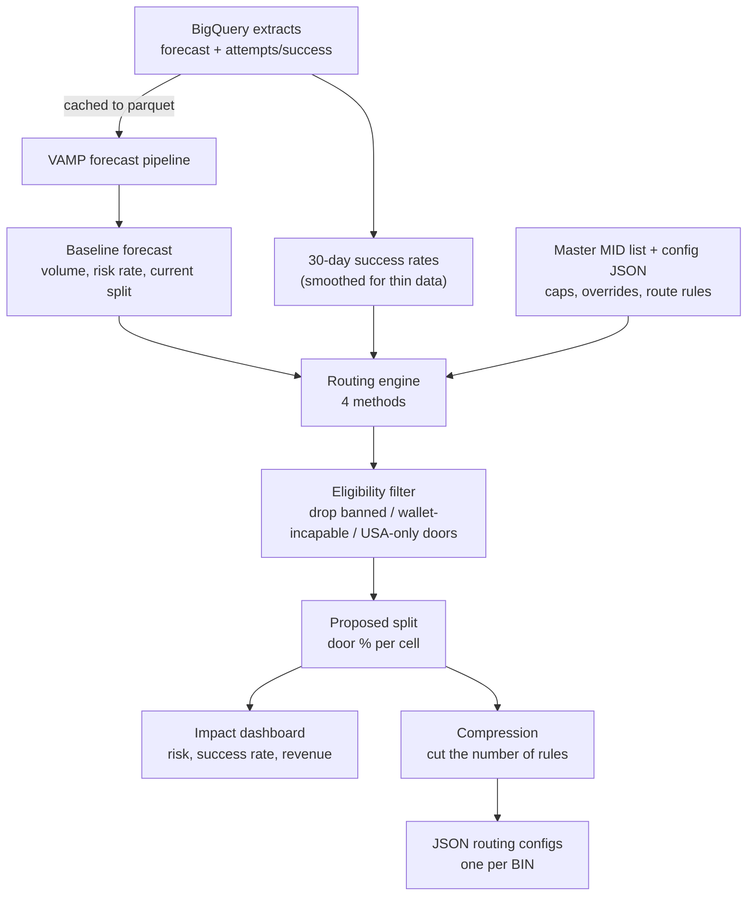
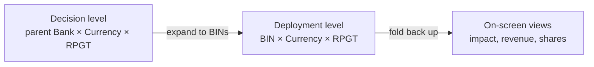
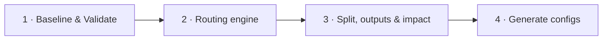
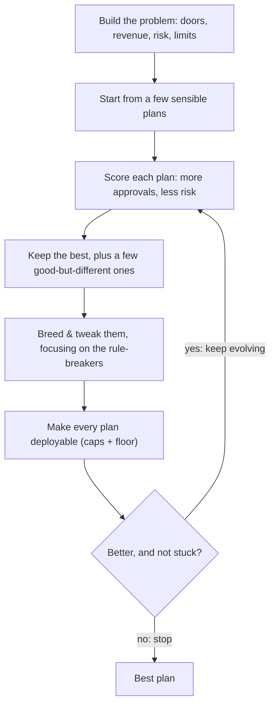

# Transaction Routing Optimiser

Every card payment can be sent through one of several **payment routes** (gateways).
Some routes get more payments approved; some are riskier (more chargebacks). This tool
decides **what share of each group of payments to send down each route**, aiming to get
as many approved as possible while keeping risk inside safe limits — then turns that plan
into ready-to-deploy config files.

**The one analogy to remember:** each gateway is a **door** you can send a payment through.
This tool decides how many payments go through each door.

A **cell** is one `transaction-type × currency × bank` combination — the tool makes one
routing decision per cell.

---

## Words used here (plain English)

You only really need these:

- **Cell** — one bank × currency × transaction-type group. One routing decision is made per cell.
- **Gateway / MID** — a payment route (a "door"). A MID is a merchant account at a gateway.
- **Split** — the plan: what percentage of a cell's payments goes through each door. Adds up to 100%.
- **Success rate** — the share of payments that get approved. Higher is better.
- **Risk rate (VAMP rate)** — the share that turn into chargebacks/fraud flags. Lower is better.
- **VAMP** — Visa's fraud-monitoring programme. Go over its limit and you get penalised, so we keep risk under it.
- **BIN** — the first few digits of a card number that identify the issuing bank. The fine-grained level real risk and deployed configs use.
- **Baseline** — how things are routed *today*. Every proposal is compared against this "before" picture.
- **Engine** — the method that decides the split. Four are available; they all take the same inputs and produce the same kind of plan, so you can swap between them freely.
- **Pool / config** — one deployable routing rule (a JSON file). "Pools" = how many rules ship.
- **Compression** — grouping near-identical cells so they can share one rule (fewer files to deploy).
- **Eligibility** — hard yes/no route rules: some doors are banned, some can't do wallet payments (Apple/Google Pay), some only serve USA traffic. Ineligible doors get zero share.

---

## What you can set (the controls)

Grouped by the panel they live in. Defaults are in brackets.

### 1 · Company & forecast
- **Company** — whose data to load and route (e.g. TotalAV).
- **Card scheme** — which card network to optimise (visa / mastercard). Also sets the risk programme and BIN prefix.
- **Forecast volume (M0…Total)** — the number of transactions the plan is applied to this month.

### 2 · Routing engine
- **Split engine** — which method decides the plan (see "The four engines" below). **Genetic** is the default.
- **Engine score grain** — how much data to pool when judging a door's success rate. *Bank × Currency* blends all transaction types (more data, steadier); *Bank × Currency × RPGT* is per-type (more specific, but noisier).
- **Optimisation grain** — the level the plan is actually made at. *Bank × Currency × RPGT* makes a separate plan per transaction type (the default).
- **Max share per gateway** — the most any single door can take of a cell [0.97 = never more than 97%, so there's always a backup].
- **Exploration floor** — a minimum share every eligible door keeps, so no door ever goes fully dark [1%].
- **Search budget (Genetic only)** — how hard the search looks: number of rounds, candidate plans per round, independent restarts. More = potentially better, but slower. Sensible defaults are filled in and a live estimate of the search size shows underneath.

### 3 · Data & pre-processing
- **Start / End date** — the window of past results used to estimate success and risk rates [~last 14 days].
- **Max pools** — the cap on how many rule files ship. `0` = no compression (one rule per BIN); a number trims to at most that many, keeping the high-volume detail first [500].
- **Apply time decay + half-life** — weight recent attempts more than old ones. Half-life is how fast old ones fade [15 days: a 15-day-old attempt counts half].
- **Low-volume smoothing** — how thin-data doors are steadied. *Empirical Bayes* auto-tunes the smoothing per Bank × Currency (default); *Fixed Number* uses one strength for all.

### 4 · Risk limits
- **VAMP cap (%)** — the risk-rate limit the engine tries to keep each MID under [6%].
- **Per-MID targets** — optional monthly targets for a specific MID (a ceiling to stay under, a floor to stay above, or a range), each with a priority so the least-important target gives way first when they can't all be met.

---

## How it flows

```
Baseline forecast (today's routing)
   → Routing engine        pick an engine, set the limits, run the search
   → Proposed split        one plan: what % of each cell goes to each door
                           (ineligible doors — banned / wallet / USA-only — are filtered out)
   → Impact dashboard      risk + success-rate + revenue, before vs after
   → Compression           group near-identical cells so fewer rules ship
   → JSON configs          deployable routing files, per BIN
```

**The key design idea:** every engine reads the same input and writes the same kind of
output (a table of door percentages per cell). So switching engines is just a dropdown —
nothing downstream has to change. Like swapping the recipe but keeping the same kitchen.

### End to end



### Why two levels of detail

The **decision** is made at parent-bank level (fewer cells, more data each), but real risk
and the deployed configs are per **BIN**. So the plan is expanded to BIN level, then folded
back up for the on-screen tables. Think of deciding a household budget by category, then
itemising each receipt for the accounts.



### The app at a glance (4 tabs)



---

## The four engines

All four decide the same thing — how to divide each cell's payments between its doors —
and all take the same inputs, so you can switch from the dropdown. Ineligible doors
(banned / wallet-incapable / USA-only) are always filtered out afterwards.

### Genetic — the default (what runs in production)

Tries out loads of different ways to split the traffic, keeps the ones that work best, then
mixes and tweaks them and tries again — a bit like **breeding for the strongest result over
many rounds**. It's the best at juggling *all* the limits at once (risk caps, per-bank
targets), which is why it's the default.



### Softmax

Sends **more** traffic to the doors that get more payments approved — but never everything
to one door (it always keeps a spread). Like **picking your strongest players without
benching everyone else.**

### Thompson (bandit)

Mostly backs whichever door is *probably* best right now, but keeps giving newer, less-tested
doors a few tries in case one turns out great. Like **mostly playing your favourite game but
trying new ones too, so you don't miss a hidden winner.**

### Portfolio

Like **spreading pocket money across several piggy banks.** It favours good performers but
avoids the unpredictable ones that could suddenly go bad (a chargeback spike), giving up a
tiny bit of success rate for fewer nasty surprises.

---

## First-time setup

Tested on macOS with **Python 3.8+** (also runs on Linux). Steps 1–3 get the app running
against previously-saved results; steps 4–5 are only needed to pull fresh data from BigQuery.

### 1. Get the code
```bash
git clone <YOUR_REPO_URL> routing_optimiser
cd routing_optimiser
```

### 2. Set up Python and install dependencies
```bash
python3 -m venv .venv
source .venv/bin/activate            # Windows: .venv\Scripts\activate
python -m pip install --upgrade pip
pip install -r requirements.txt
```

### 3. Run the app
```bash
streamlit run app/streamlit_app.py
```
Opens at <http://localhost:8501>. You can use it **without BigQuery**: on tab 1 choose
**"Load a previously-run baseline"** and point it at a folder under
`data/outputs/<MONTH>/<COMPANY>/`. (Those folders are gitignored, so on a fresh clone you'll
need to run the pipeline once — steps 4–5 — or copy an existing outputs folder in.)

### 4. Install the Google Cloud SDK (only for live BigQuery runs)
A **live** run reads the forecast + attempts from BigQuery (project `sapient-tangent-172609`),
so it needs the `gcloud` CLI. The SDK isn't committed to the repo — install your own:
```bash
brew install --cask google-cloud-sdk          # macOS (Homebrew)
# …or the official installer:
curl https://sdk.cloud.google.com | bash
exec -l $SHELL                                 # reload your shell so `gcloud` is on PATH
gcloud --version
```

### 5. Sign in to BigQuery
```bash
gcloud auth login                                             # your Google account
gcloud auth application-default login                         # creds the Python client uses
gcloud config set project sapient-tangent-172609
gcloud auth application-default set-quota-project sapient-tangent-172609
```
If a query returns a 403, ask your admin for access to the `sapient-tangent-172609` project.

A live forecast then works: on tab 1 pick **"Run VAMP pipeline"**, or run it headless:
```bash
python main.py
```
Extracts are cached to parquet under `data/cache/`, so later runs only re-query BigQuery when
something new is needed (a new month or company).

### 6. After changing any backend code
Streamlit reuses compiled bytecode, and stale `.pyc` files are the most common cause of "it
still looks wrong after my edit". Clear the cache and fully restart (Ctrl+C the process —
closing the browser tab isn't enough):
```bash
find . -name __pycache__ -type d -exec rm -rf {} +
streamlit run app/streamlit_app.py
```

---

## Wiring in your real data

The real VAMP forecast pipeline lives under `src/vamp_pipeline/` (Extract → Actuarial →
Allocate → Export), and its queries live in `queries/`. The gateway→MID mapping
(`data/mappings/Master_MID_List.csv`) is wired in so `vampMid`s resolve exactly as in
production. Pick the baseline source on tab 1:

1. **Run VAMP pipeline** — runs the full pipeline from your settings, reusing cached BigQuery
   extracts where it can (only re-queries on something new, e.g. a new month or company).
2. **Load a previously-run baseline** — point at a prior output folder. No BigQuery, no new
   forecast computed.
3. **Synthesise from attempts (offline)** — a stand-in baseline for the bundled sample.

Under the hood the pipeline's `Sim_Sales` becomes each cell's `volume`, `Sim_Rate` (VAMPs ÷
sales) becomes its `risk_rate`, and each door's share becomes its `baseline_share` — at
`vampMid × RPGT × BIN × Currency` grain. Success rates come from the attempts extract, smoothed
for thin data.

---

## Honest caveats

- The tool uses the **real pipeline baseline** when you run live or point at its outputs; the
  synthesiser is only a no-BigQuery fallback.
- The VAMP cap is applied per cell; **global per-acquirer caps** would need an extra layer on top.
- On the bundled 50-row sample the attempts data and a real pipeline baseline don't share the
  same BIN/gateway space, so success rates fall back to the pooled average. On your real data
  (same keys) they join properly.

---

## Project layout

```
src/routing_optimiser/
  constraints.py       the hard/soft limits + run settings
  success_rates.py     per-door success rates (smoothed for thin data)
  data_loader.py       load the baseline forecast → one problem per cell
  engines/             base + softmax / thompson / portfolio (genetic runs separately)
  genetic_global.py    the genetic (CMA-ES) search
  numba_kernels.py     the fast, compiled version of the genetic scoring loop
  band_scoring.py      per-MID monthly-target scoring during the search
  band_projection.py   the exact risk projection those targets are scored against
  optimiser.py         run an engine across all cells
  eligibility.py       banned / wallet / USA-only route rules
  kmeans_compress.py   group near-identical cells to cut the rule count
src/vamp_pipeline/     the real forecast pipeline
queries/               the pipeline's BigQuery extracts
app/streamlit_app.py   the app (4 tabs)
app/impact_calcs.py    before→after impact projection + config templates
app/tab_configs.py     the "Generate configs" tab
config/settings.yaml   VAMP pipeline settings (the app mirrors this)
```
